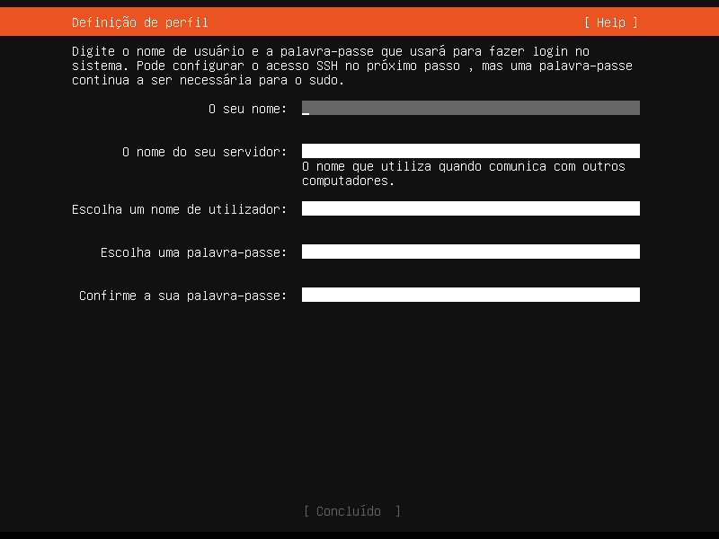
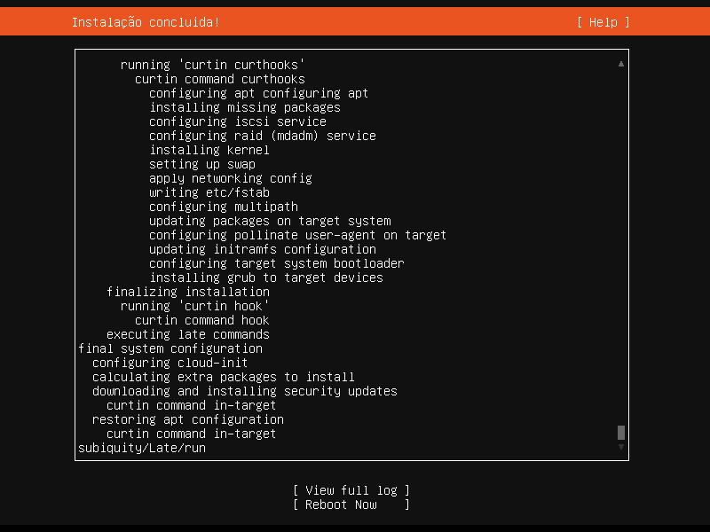
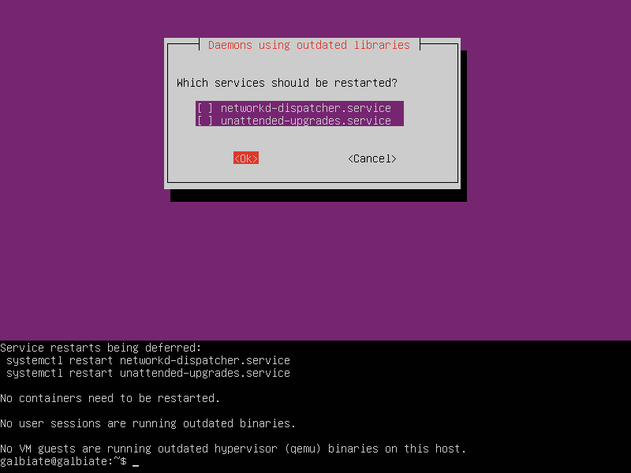
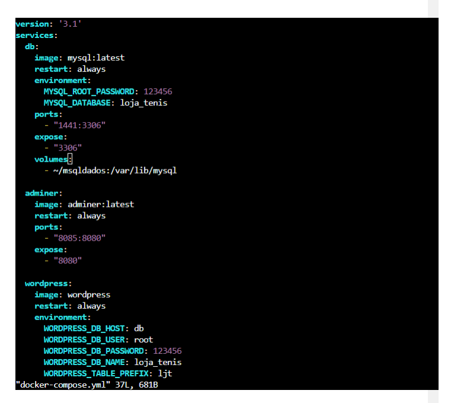
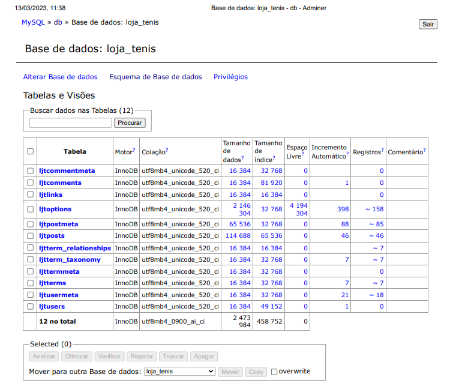

# Documentação
## Ubuntu Server

Primeiro passo é fazer a instalação do Ubuntu Server na máquina virtual. Pode ir dando enter e quando aparecer essa tela é só colocar os dados

O dowload demora para acontecer, mas é necessário aguardar até aparecer a mensagem "REBOOT NOW" como na imagem a seguir:

Após isso você pode reiniciar a máquina e instalar o cockpit para utilizar no navegador, pois é bem melhor.

Comando para a instalação: sudo apt-get install cockpit

Após instalar o cockit podemos utilizar através do navegador e agora é só dar os comandos a seguir:

### sudo apt-get update && sudo apt-get upgrade
 - Comando para atualizar e executar os pacotes.
#

### sudo apt-get install docker
- Comando para instalação do Docker.
# 
### sudo apt-get install docker-compose
- Comando para instalar o Docker-compose
#
### mkdir 
- Comando para criar uma pasta que será utilizada no volume (VIM).
#
### vim Docker-compose.yml
- Comando para abrir o vim e colocar os volumes dentro. Nesse caso o vim tem os volumes do MYSQL, ADMINER e WORDPRESS:

#
### sudo usermod -aG docker 
- Comando para dar permissão do docker, e depois da palavra docker tem que colocar o nome.
#
### sudo usermod -aG docker ${USER}
- Comando para dar permissão do docker.
#
### docker-compose up 
- Comando para rodar a aplicação.
#

### sudo systemctl status docker
- Comando para saber como está o status do Docker, se está active quer dizer que está ativo.

PRONTO AGORA JÁ ESTÁ INSTALADO E CONFIGURADO O DOCKER E O DOCKER COMPOSE.

#
# SITE WORDPRESS
Esse é o print do meu site de tênis funcionando.

#

# ADMINER
No adminer nós criamos um banco de dados, como no exemplo da minha loja a seguir: 

